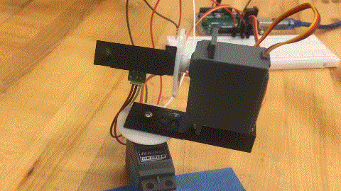

# PIE-Mini-Project-2
The following report aims to depict the mechanical, computational, and collaborative work done to build and program a rudimentary 3D-scanner using a pan/tilt mechanism. The purpose in completing this project was to introduce us to sensors and actuators.   

### Abstract:   

In this mini-project we were tasked with building a 3D-scanner that could effectively visualize three-dimensional data. Once we built the scanner, we were tasked with scanning a letter of well-known geometry, and then visualizing the output from the scanner on a software medium of our choice. For this task we chose to go with scanning the letter "S".

---
